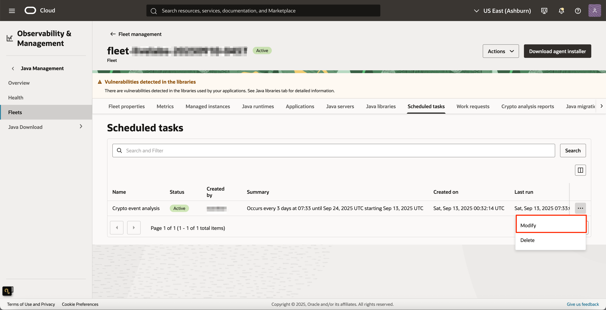
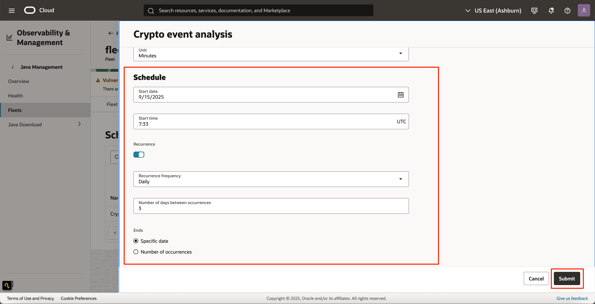
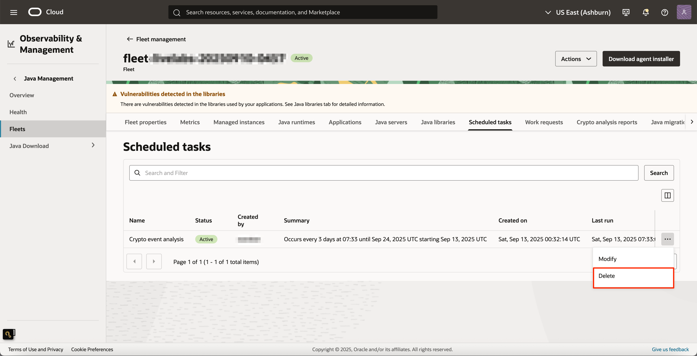
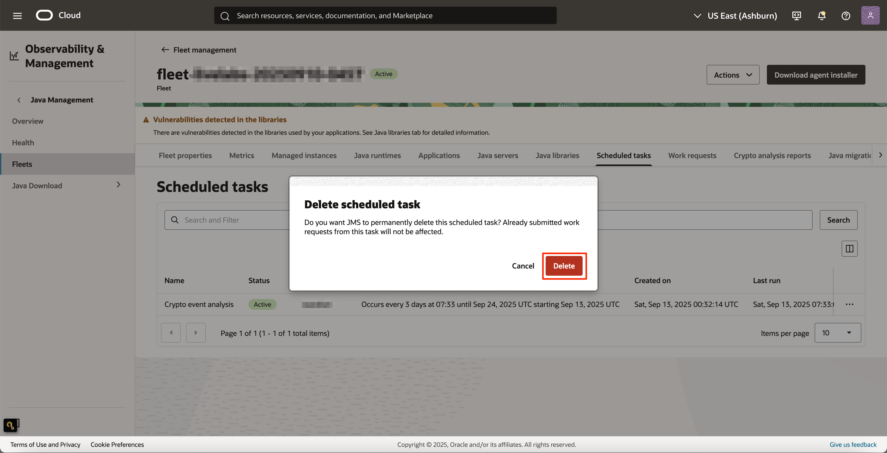

# View and manage Scheduled Tasks

## Introduction

This lab walks you through the steps to view and manage the scheduled tasks you have created.

Estimated Time: 15 minutes

### Objectives

In this lab, you will:

  * View the scheduled tasks that you have created with information about the current status of the task, summary, last run, next run etc
  * Modify an existing scheduled task using the Java Management Service console interface
  * Delete an existing scheduled task using the Java Management Service console interface

### Prerequisites

  * You have signed up for an account with Oracle Cloud Infrastructure and have received your sign-in credentials.
  * You are using an Oracle Linux image or Windows OS on your Managed Instance for this workshop.
  * Access to the cloud environment and resources configured in [Lab 1](?lab=set-up-and-enable-advanced-features-on-java-management-service).
  * You have at least one scheduled task added for the fleet of interest. If not, you can create one for any one of the advanced feature using below labs.

    * [Configure post install actions and install Java Runtimes](?lab=configure-post-install-actions-and-install-java-runtimes)
    * [Detect Java Libraries](?lab=detect-java-libraries)
    * [Run Crypto Event Analysis](?lab=run-crypto-event-analysis)
    * [Run Java Migration Analysis](?lab=run-java-migration-analysis)
    * [Run JDK Flight Recorder (JFR)](?lab=run-jdk-flightrecorder-jfr)
    * [Run Performance Analysis](?lab=run-performance-analysis)
    * [Track Java Servers](?lab=track-java-servers)

## Task 1: Overview of Scheduled task detailed view
1. First, open the navigation menu, click **Observability & Management**, and then click **Fleets** under **Java Management**. Select the fleet that you are interested in.

 

2. Under **Resources**, select **Scheduled tasks**. You should see a list of scheduled tasks that you have created.

 

3. Scheduled task table has the following information of a scheduled task
    * **Name** of the scheduled task like Install Java runtime, Crypto event analysis etc
    * Current **Status** of the scheduled task
    * User who created the schedule
    * Schedule **summary**
    * **Date and time** when the scheduled task been **created**, **last run** and **next run**.

 

## Task 2: (Optional) Modifying a scheduled task

1. You can modify an existing scheduled task by clicking the **...** of the scheduled task of interest and click **Modify**

 

 

 Modifying a scheduled task is same for any advanced feature, it goes through the same steps allowing you to modify the request fields and also the schedule preference. Here is an example for Crypto event analysis.

 

 Once the changes are made, click **Submit** button to save the changes.

## Task 3: (Optional) Deleting a scheduled task

1. You can delete a scheduled task by clicking the **...** of the scheduled task of interest and click **Delete**

 

 

2. You will see a dialog message to confirm the deletion. If you want to delete, click the **Delete** button.

 

 >**Note:** When a scheduled task is deleted, you cannot undo the action and also note that already submitted work requests from this task will not be deleted.

## Acknowledgements

 * **Author** - Satish Sarakanam, Java Management Service
